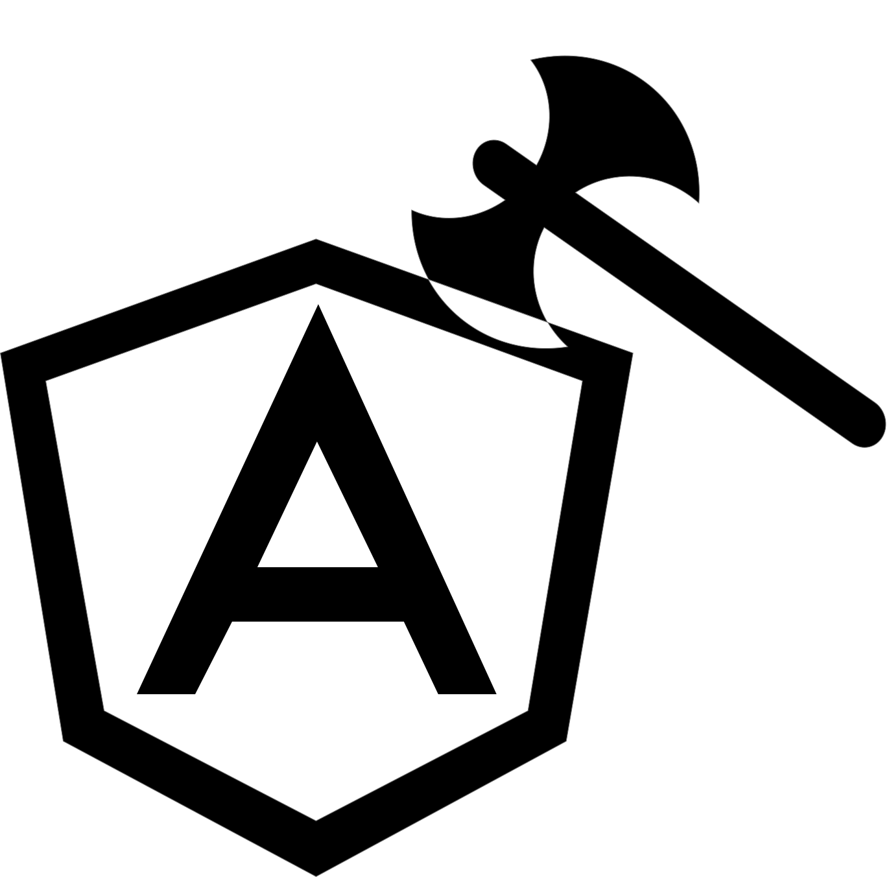

<p align="center">
 
</p>

[Logo by Felipe Zambrano](http://instagram.com/octopez)

<br />

[]()
[]()
[]()
[](https://github.com/prettier/prettier)
[](#contributors-)
[](https://github.com/ngworker/)
[]()

> Create Angular logs like a professional lumberjack

Lumberjack is a versatile Angular Logging library, specially defined to be extended and customized. It provides some out-of-the-box [log-driver](https://en.wikipedia.org/wiki/Log_driving), (logging mechanisms, transports, log-drivers) but you can easily decide which ones to use and create your owns.

## Features

- ✅ Configurable multilevel logging
- ✅ Plugin based (log-driver) architecture
- ✅ ConsoleDriver
- ✅ HttpDriver
- ✅ LogCreators Utils
- ✅ Best Practices guide

## Table of Contents

- [Installation](#installation)
- [Usage](#usage)
- [FAQ](#faq)

## Installation

### NPM

`npm install @ngworker/lumberjack`

### Yarn

`yarn add @ngworker/lumberjack`

## Usage

To start using this app just import it in your application root module.

```typescript
...,
LumberjackModule.forRoot({
  //options
}),
...,
```

You must also import the `LogDrivers` that you intend to use.

```typescript
...,
LumberjackModule.forRoot({
  //options
}),
ConsoleDriverModule.forRoot(),
HttpDriverModule.forRoot({
  origin: 'LoggedExampleApp',
  storeUrl: environment.baseUrl,
  logWagonSize: 1
    }),
...,
```

The `LumberjackModule` can be initialized empty where it falls back to a default configuration or receive a `LumberjackLogConfig` object.

```typescript
export interface LumberjackLogConfig {
  format(logEntry: LumberjackLog): string;
}
```

`format` is a function that receives a `LumberjackLog` and produces a string representation of the same.

```typescript
/**
 * Represents a Lumberjack Log.
 *
 */
export interface LumberjackLog {
  level: LumberjackLogLevel;
  message: string;
  context: string | undefined;
}
```

### Using the `LumberjackService`

First, inject the `LumberjackService` where you want to use it.

```typescript
constructor(
    ...,
    private lumberjack: LumberjackService,
    ...,
  ) {}
```

Then you can start logging.

```typescript
this.lumberjack.log({
  level: LumberjackLogLevel.Info,
  message: 'Hello Forest',
  context: 'AppComponent',
});
```

However, the above example is not the recommended way to define our logs.

More on this in the **Recomended Best Practices** section.

### Default configurations

As seen for now the only configurable item for `lumberjack` is the format function.

Its default implementation can be seen below.

```typescript
export const defaultLogConfig: LumberjackLogConfig = {
  format(logEntry: LumberjackLog) {
    return `${logEntry.level.toString()}  ${new Date().toISOString()}  [${logEntry.context}] ${logEntry.message}`;
  },
};
```

The `LumberjackLogConfig` will be expanded as new functionalities are added to the library.

It is recommended to implement different logging configuration, looking the best fit for the current scenario.

## Log Drivers

We briefly introduce the term of `log-driver`, this section explains in depth how to use and modified them and how to create new ones.

A `log-driver` is the conduit used by the `LumberjackService` to write or persist the developer logs.

This library provides some basic `log-drivers` out of the box, the `ConsoleDriver` and the `HttpDriver`.

> Note: Consider the HttpDriver as an example of what can be achieved. It may not fit your app requirements.

Every `log-driver` implements the interface `LogDriver`.

```typescript
export interface LogDriver {
  config: LogDriverConfig;
  logInfo(logEntry: string): void;
  logDebug(logEntry: string): void;
  logError(logEntry: string): void;
  logWarning(logEntry: string): void;
}
```

The above is the public API that every `log-driver` must implement.

### Creating your own Driver

Let's see the easiest implementation of a `log-driver`, the `ConsoleDriver`

```typescript
@Injectable()
export class ConsoleDriver implements LogDriver {
  constructor(public config: LogDriverConfig) {}

  logInfo(logEntry: string): void {
    console.log(logEntry);
  }
  logDebug(logEntry: string): void {
    console.log(logEntry);
  }
  logError(logEntry: string): void {
    console.error(logEntry);
  }
  logWarning(logEntry: string): void {
    console.warn(logEntry);
  }
}
```

There is nothing special about it, the only remarkable thing is that the config is passed down its constructor and that it is public. We will need a public configuration when interacting with the `log-drivers` at the `LumberjackService`

### `ConsoleDriverModule`

The `DriverModule's` provides the configuration and other dependencies to the `log-drivers`. They also provide the `log-drivers`, making them available to the `LumberjackService`.

```typescript
@NgModule()
export class ConsoleDriverModule {
  static forRoot(config: LogDriverConfig = defaultLogDriverConfig): ModuleWithProviders<ConsoleDriverRootModule> {
    return {
      ngModule: ConsoleDriverRootModule,
      providers: [{ provide: LogDriverConfigToken, useValue: config }],
    };
  }

  constructor() {
    throw new Error('Do not import ConsoleDriverModule directly. Use ConsoleDriverModule.forRoot.');
  }
}
```

In this implementation the `ConsoleDriverModule` is protected from being used directly. Instead we should use the `forRoot()` method.

The `forRoot()` method provides the `LogDriverConfigToken` and returns the `ConsoleDriverRootModule` which holds the rest of the driver setup.

```typescript
@NgModule({
  providers: [
    {
      provide: LogDriverToken,
      useClass: ConsoleDriver,
      multi: true,
    },
  ],
})
export class ConsoleDriverRootModule {
  constructor(@Optional() @SkipSelf() maybeNgModuleFromParentInjector?: ConsoleDriverRootModule) {
    if (maybeNgModuleFromParentInjector) {
      throw new Error(
        'ConsoleDriverModule.forRoot registered in multiple injectors. Only call it from your root injector such as in AppModule.'
      );
    }
  }
}
```

The most important thing about the `ConsoleDriverRootModule` is that it provides the `ConsoleDriver` using the `LogDriverToken` using the `multi` flag on.

This allows us to provide multiple `log-drivers` at the same time and is the feature enabling the extensibility of the `lumberjack` library.

`ConsoleDriverRootModule` is protected against multiple imports. Since `ConsoleDriverModule.forRoot()` should only be imported once.

The last step is to import this module at the root module of our application as seen in the first usage section.

```typescript
@NgModule({
  ...,
  imports: [
    ...,
    LumberjackModule.forRoot(),
    ConsoleDriverModule.forRoot(),
    ...
  ],
  ...
})
export class AppModule {}
```

If none configuration is passed the default configuration is assumed.

### HttpDriver

For a more advanced example of a `driver` implementation check the [HttpDriver](https://github.com/ngworker/lumberjack/blob/master/projects/ngworker/lumberjack/http-driver/README.md)

## Proposed Best Practices

Every log can be represented as a combination of its level, message, and context. Using inline logs entries with the `LumberjackService` can cause structure duplication and-or de-standardization.

As a way to avoid these problems, the following practices are recommended.

### Log definitions

Inspired on events from event-driven architectures and Redux/NgRx actions a Log creator was implemented. The function `createLog` shown below, receives a log level, a message, and a context and returns a factory function of `LumberjackLog` elements.

```typescript
/**
 * Represents a Nevco specific log.
 *
 * @export
 * @interface LumberjackLog
 */
export interface LumberjackLog {
  level: LumberjackLogLevel;
  message: string;
  context: string | undefined;
}

export function createLog(level: LumberjackLogLevel, message: string, context?: string): () => LumberjackLog {
  return () => ({ level, message, context });
}
```

Every `LumberjackLogLevel` SHOULD have a folder where the well-defined logs are implemented. We CAN further organize the logs by grouping them by feature, app or context using Typescript modules (files).

Each `LumberjackLogLevel` folder contains an `index.ts` file where a composed log creator is implemented making the creation of logs of the same level less verbose.

The following is one of such **LogLevel-wise** log creators, in this case for the logs of level `Info`.

```typescript
export function createInfoLog(message: string, context: string = ''): () => LumberjackLog {
  return createLog(LumberjackLogLevel.Info, message, context);
}
```

Once our creators are defined, we can start adding our logs following the chosen folder/file structure, but always respecting the log level folder distribution.

```typescript
export const ExampleInfoLog = createInfoLog('The forest has two new trees', 'ForestComponent');
```

By following these guidelines you ensure that your log levels aren't duplicated and that their structure is homogeneous across the workspace. They are also easy to find and modify.

#### Log usage

Now that we have defined our first `LumberjackLog` creator let's use `LumberjackService` to start adding log entries to our system.

```typescript
@Component({
  selector: 'new-forest',
  templateUrl: './forest.component.html',
  styleUrls: ['./forest.component.scss']
})
export class ForestComponent {
  ...

  constructor(
    ...,
    private logger: LumberjackService
  ) {
    this.logger.log(ExampleInfoLog());
  }
}
```

## Contributors ✨

Thanks goes to these wonderful people ([emoji key](https://allcontributors.org/docs/en/emoji-key)):

<!-- ALL-CONTRIBUTORS-LIST:START - Do not remove or modify this section -->
<!-- prettier-ignore-start -->
<!-- markdownlint-disable -->
<table>
  <tr>
    <td align="center"><a href="https://github.com/NachoVazquez"><br /><sub><b>Nacho Vazquez</b></sub></a><br /><a href="#question-NachoVazquez" title="Answering Questions">💬</a> <a href="https://github.com/@ngworker/lumberjack/issues?q=author%3ANachoVazquez" title="Bug reports">🐛</a> <a href="#business-NachoVazquez" title="Business development">💼</a> <a href="https://github.com/@ngworker/lumberjack/commits?author=NachoVazquez" title="Code">💻</a> <a href="https://github.com/@ngworker/lumberjack/commits?author=NachoVazquez" title="Documentation">📖</a> <a href="#example-NachoVazquez" title="Examples">💡</a> <a href="#ideas-NachoVazquez" title="Ideas, Planning, & Feedback">🤔</a> <a href="#infra-NachoVazquez" title="Infrastructure (Hosting, Build-Tools, etc)">🚇</a> <a href="#maintenance-NachoVazquez" title="Maintenance">🚧</a> <a href="#projectManagement-NachoVazquez" title="Project Management">📆</a> <a href="https://github.com/@ngworker/lumberjack/pulls?q=is%3Apr+reviewed-by%3ANachoVazquez" title="Reviewed Pull Requests">👀</a> <a href="#security-NachoVazquez" title="Security">🛡️</a> <a href="https://github.com/@ngworker/lumberjack/commits?author=NachoVazquez" title="Tests">⚠️</a> <a href="#tool-NachoVazquez" title="Tools">🔧</a> <a href="#userTesting-NachoVazquez" title="User Testing">📓</a></td>
    <td align="center"><a href="https://indepth.dev/author/layzee/"><br /><sub><b>Lars Gyrup Brink Nielsen</b></sub></a><br /><a href="https://github.com/@ngworker/lumberjack/issues?q=author%3ALayZeeDK" title="Bug reports">🐛</a> <a href="https://github.com/@ngworker/lumberjack/commits?author=LayZeeDK" title="Code">💻</a> <a href="https://github.com/@ngworker/lumberjack/commits?author=LayZeeDK" title="Documentation">📖</a> <a href="#example-LayZeeDK" title="Examples">💡</a> <a href="#ideas-LayZeeDK" title="Ideas, Planning, & Feedback">🤔</a> <a href="#mentoring-LayZeeDK" title="Mentoring">🧑‍🏫</a> <a href="#plugin-LayZeeDK" title="Plugin/utility libraries">🔌</a> <a href="https://github.com/@ngworker/lumberjack/pulls?q=is%3Apr+reviewed-by%3ALayZeeDK" title="Reviewed Pull Requests">👀</a> <a href="https://github.com/@ngworker/lumberjack/commits?author=LayZeeDK" title="Tests">⚠️</a> <a href="#tool-LayZeeDK" title="Tools">🔧</a> <a href="#userTesting-LayZeeDK" title="User Testing">📓</a></td>
  </tr>
</table>

<!-- markdownlint-restore -->
<!-- prettier-ignore-end -->

<!-- ALL-CONTRIBUTORS-LIST:END -->

This project follows the [all-contributors](https://github.com/all-contributors/all-contributors) specification. Contributions of any kind welcome!
